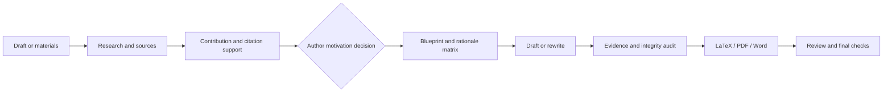
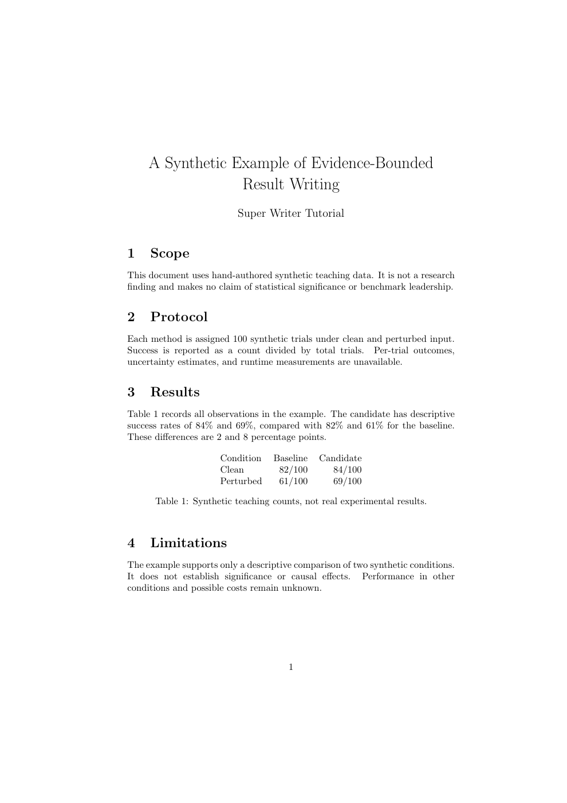

# Super Writer

**Evidence-backed academic writing, from research materials to a traceable manuscript.**

[中文](README.md) · [Releases](https://github.com/asimfish/super_writer/releases/latest) · [Skill](SKILL.md) · [Examples](docs/usage.md) · [Validation](docs/validation.md)

[](https://github.com/asimfish/super_writer/actions/workflows/ci.yml)
[](LICENSE)

`super_writer` is a standalone Agent Skill repository. Invoke it as **`super-writer`**.
It organizes sources, contribution claims, motivation, writing decisions, and
delivery checks for an AI agent working on an academic paper or report.

Extracted from [Super Skill Team](https://github.com/asimfish/super_skill_team/tree/main/skills/paper/paper-spine)
and adapted from [PaperSpine](https://github.com/WUBING2023/PaperSpine) V4.
Pinned provenance and license attribution are in [UPSTREAM.md](UPSTREAM.md).

## Capabilities

| Task | Design | Outputs |
|---|---|---|
| Build from materials | Inventory before claims | Source/evidence banks, asset map, claim register, draft |
| Rewrite a manuscript | Preserve and audit the argument | Original logic map, rewrite matrix, logic-transfer audit |
| Frame the contribution | Separate need, novelty, evidence, and boundaries | Confirmed contribution, SOTA gap map, author-approved motivation |
| Learn exemplars | Separate rhetorical learning from cited evidence | Exemplar dossier and style profile |
| Ground citations | Link each candidate to a sentence-level claim | Citation Support Bank and metadata checks |
| Plan before drafting | Explain each writing unit's purpose and evidence | Section blueprints and Writing Rationale Matrix |
| Review results | Map results to contribution promises | Results validation and reviewer objection records |
| Deliver documents | Check source and converted output | LaTeX, compiled PDF when available, Word, Chinese translation |
| Prepare submission or response | Requested extensions | Highlights, cover letter, reviewer response package |

Two workflows (`rewrite_existing`, `build_from_materials`), four scenes
(`journal`, `conference`, `report_review`, `competition`), English/Chinese output,
and `flash` / `pro` research depth. Optional style calibration uses measurable
text patterns; it does not promise to bypass AI detectors.

## Workflow



`SKILL.md` routes the task; `references/` contains stage playbooks; `agents/`
contains specialist role cards; `scripts/` contains 25 Python tool files.
Bounded audit, translation, and response requests use their relevant playbooks.

## Install and Start

Requirements: **Python 3.10+** and a file-capable AI agent. The Python guards use
the standard library. Word export needs Pandoc; PDF compilation needs a TeX
toolchain. No model, API key, Pandoc, or TeX distribution is bundled.

```bash
git clone https://github.com/asimfish/super_writer.git
cd super_writer
python3 tools/install_skill.py --destination "${CODEX_HOME:-$HOME/.codex}/skills/super-writer"
```

For Claude Code, use `--destination "$HOME/.claude/skills/super-writer"`.
On Windows use `python` or `py -3` and an explicit destination path.
The installer refuses to overwrite existing installations. Start a new agent
session after installation:

```text
Use $super-writer to revise draft.tex for my specified conference.
Inspect existing progress and evidence, confirm the contribution and motivation,
then plan and revise section by section. Preserve all experimental numbers and
equations. Deliver an English manuscript and Word file.
```

Alternatively, download `super_writer-v1.0.0-skill.zip` from
[Releases](https://github.com/asimfish/super_writer/releases). It contains one
`super-writer/` directory. Other agents can load its `SKILL.md` directly.
Web environments need file extraction and Python execution to run guards;
text-only environments can use the instructions but cannot claim script checks.

See [usage prompts](docs/usage.md) and the
[synthetic study](examples/synthetic-study/). All sample measurements are
explicitly synthetic, not research results or evidence of publication success.

[Example PDF](examples/synthetic-study/manuscript.pdf) · [Example Word](examples/synthetic-study/manuscript.docx)



## Check and Package

Run these development commands from a source checkout:

```bash
python3 scripts/latex_guard.py examples/synthetic-study/manuscript.tex --markdown
python3 scripts/smoke_test.py
python3 -m unittest discover -s tests -v
python3 tools/build_release.py
```

The release builder produces a versioned ZIP, per-file manifest, and SHA-256
checksum. CI verifies tools and distribution behavior. Scientific quality and
source-to-claim validity still require substantive author/reviewer judgment.

## Compatibility and Limits

Outputs remain in `paper_rewriting_output/`; legacy config
`paper_spine_config.json`, artifact names, and `PAPERSPINE_CONFIG_HOME` are
preserved. Word is required in a full run unless `word_output=none` is explicit.

Inherited guards favor numeric citations and compact section structures.
Author-year styles, specialized templates, and multi-file manuscripts need
template-aware review. A progress inventory is not a fresh audit receipt.
See [validation scope and known limitations](docs/validation.md).

## Contributing and License

See [CONTRIBUTING.md](CONTRIBUTING.md) for reproducible issue reports and checks,
and [skill-card.md](skill-card.md) for file, network, and execution capabilities.

[MIT licensed](LICENSE), preserving PaperSpine contributors' copyright.
The bilingual documentation and release layout were informed by
[paper-framework-figure-studio-pro](https://github.com/c-narcissus/paper-framework-figure-studio-pro).
Its code, papers, figures, and skill packages are not included.
