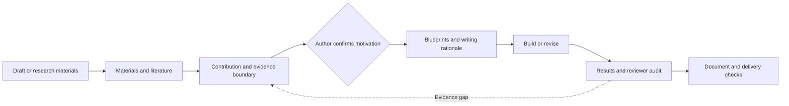

<h1 align="center">Super Writer</h1>
<p align="center"><strong>Give every claim evidence. Give every paragraph a reason.</strong></p>
<p align="center">An Agent Skill for academic drafting, structural revision and reviewer responses</p>

<p align="center"><a href="README.md">中文</a> · English · <a href="#examples">Examples</a> · <a href="#quick-start">Quick start</a> · <a href="#verification">Verification</a> · <a href="SKILL.md">Agent entrypoint</a></p>

[](https://github.com/asimfish/super_writer/actions/workflows/ci.yml)
[](https://github.com/asimfish/super_writer/releases)
[](LICENSE)
[](DATA_LICENSE)
[](docs/validation.md)
[](https://github.com/asimfish/super_writer/stargazers)

**Have the experiments and a draft, but not a clear contribution?** Super Writer
organizes contributions, evidence and claim boundaries before planning the
manuscript. It then checks citations, result interpretation and document delivery.
It is not just a synonym-replacement prompt, and it must not turn missing
experiments into completed results.

The repository is `super_writer`; invoke **`$super-writer`**. Your AI agent does
the writing. Python scripts supply repeatable checks. No model is bundled,
and no acceptance or AI-detector outcome is promised.

<a id="examples"></a>
## Start With the Examples

<table>
<tr>
<td width="33%" align="center"><a href="examples/knn-regression/manuscript.pdf"></a></td>
<td width="33%" align="center"><a href="examples/theory-note/manuscript.pdf"></a></td>
<td width="33%" align="center"><a href="examples/review-response/response.pdf"></a></td>
</tr>
<tr>
<td align="center"><strong>Reproducible study · 3 pages</strong><br><a href="examples/knn-regression/manuscript.md">Read</a> · <a href="examples/knn-regression/manuscript.pdf">PDF</a> · <a href="examples/knn-regression/manuscript.docx">Word</a></td>
<td align="center"><strong>Theory note · 2 pages</strong><br><a href="examples/theory-note/manuscript.md">Read</a> · <a href="examples/theory-note/manuscript.pdf">PDF</a> · <a href="examples/theory-note/manuscript.docx">Word</a></td>
<td align="center"><strong>Reviewer response · 1 page</strong><br><a href="examples/review-response/response.md">Read</a> · <a href="examples/review-response/response.pdf">PDF</a> · <a href="examples/review-response/response.docx">Word</a></td>
</tr>
</table>

Previews are rendered from the actual PDFs, not mockups. These are **AI-assisted
educational worked examples checked against their materials**, not submitted
papers, accepted papers or independent blind evaluations. The empirical data
generator is synthetic, but every table value is computed by the public script.
The theorem is elementary; the reviewer comments are constructed. No private
manuscript or third-party full paper is distributed.

### Revision Means More Than Different Words

| Over-strong input | Evidence-bounded revision |
|---|---|
| "Five-neighbor regression significantly outperforms one-neighbor regression and is robust to distribution shift." | "On the in-domain grid, five-neighbor regression reduces mean MSE from 0.1083 to 0.0851 across five fixed training seeds. On the extrapolation grid, mean MSE increases from 2.6891 to 3.7012; the in-domain advantage does not extend to this tested setting." |

The revision preserves the improvement and the adverse result. Without a
significance test, it does not say "significantly."

[Raw materials](examples/knn-regression/materials/) · [Experiment](examples/knn-regression/experiment.py) ·
[Writing decisions](examples/knn-regression/writing-decisions.md) · [All examples](examples/README.md)

<a id="quick-start"></a>
## Quick Start

**Python 3.10+ and an AI agent that can read local skills are required.**
Guard scripts use the standard library. Word export needs Pandoc; PDF compilation
needs TeX. Running a guard alone does not call a model or write a paper.

```bash
git clone https://github.com/asimfish/super_writer.git
cd super_writer
python3 tools/install_skill.py --destination "${CODEX_HOME:-$HOME/.codex}/skills/super-writer"
```

For Claude Code, use `--destination "$HOME/.claude/skills/super-writer"`.
On Windows, use `python` or `py -3` and your explicit destination path.
The installer refuses existing directories. Preserve or move the previous
installation before upgrading, especially if it contains local changes.

Invoke in a fresh session:

```text
Use $super-writer to revise draft.tex using the supplied results and method notes.
Inspect the materials and existing progress, identify the contribution and gaps,
and ask me to confirm the motivation before planning sections. Preserve numbers,
equations and citation keys. Use my target venue, year and submission stage.
```

For a bounded task:

```text
Use $super-writer only to audit and revise the abstract. Do not start the full
paper workflow, search for references, or run new experiments. Identify which
claims are supported and which must be narrowed.
```

Without Git, download a versioned skill ZIP from
[Releases](https://github.com/asimfish/super_writer/releases/latest).
It contains a `super-writer/` directory. Other hosts need local file access,
plus Python execution to run checks. [More prompts and configuration](docs/usage.md)

## What It Covers

| Task | Approach | Inspectable output |
|---|---|---|
| Draft from materials | Inventory methods, results, figures and gaps | Evidence bank, contribution, manuscript |
| Structural revision | Plan what to preserve, move, rebuild or remove | Rewrite matrix, logic-transfer audit |
| Research positioning | Separate motivation, contribution and evidence | Contribution, SOTA gap map |
| Learn conventions | Transfer argument structure, not copied sentences | Style profile, section blueprints |
| Citation support | Bind sources to statements; verify metadata | Citation Support Bank |
| Writing and result audits | Record reasons; map results to promises | Rationale matrix, results-validation table |
| Submission preparation and revision | Draft scoped materials and trace responses | Submission package, response package |
| Documents and translation | Check citation links, labels, Word and coverage | LaTeX, PDF, Word, Chinese output |

Supports journal, conference, report/review and competition settings, English
and Chinese, and `flash` / `pro` research depth. It does not replace experiments,
author judgment, ethics review or submission systems, and does not send responses.

## Design: Contribution Before Rhetoric



- **Separate evidence from exemplars.** Examples teach structure; verified sources
  and the author's materials substantiate factual claims.
- **Plan the reason before the paragraph.** Important units have evidence,
  a purpose and a claim boundary.
- **Separate requirements from suggestions.** Word frequencies, section counts and
  reference age cannot replace scientific integrity or official venue rules.
- **Load progressively.** A bounded audit, translation or reply need not launch
  a full-paper workflow.

Legacy paths such as `paper_rewriting_output/` and `paper_spine_config.json`
remain compatible. Word is on by default; disable it with `word_output=none`.
Section count is advisory unless `max_sections` sets a hard budget. Collection
size and recency are advisory unless `citation_enforce_heuristics=true`.

<a id="verification"></a>
## Verification, With Boundaries

| Layer | What is checked | What it does not prove |
|---|---|---|
| Cross-platform regressions | Linux, macOS, Windows; installation, packaging, privacy, documents and guards | Equal writing performance across agents |
| Reproducible examples | 20 empirical records, rounding, seed-level sample SD, exact-rational counterexamples | A novel method or a formally verified theorem |
| Document builds | Real PDF compilation, unresolved references, overfull boxes, checked Word exports | Detection of every visual defect |
| Official template fixtures | Eight cases: ICML, ICLR, CVPR, NeurIPS in two citation modes, ACL, ECCV main and rebuttal | Complete submission compliance; AAAI is not compilation-verified |
| Writing quality | Public materials, readable manuscripts and writing decisions | Independent human blind scores, acceptance gains or detector bypass |

From the source repository root:

```bash
python3 scripts/smoke_test.py
python3 -m unittest discover -s tests -v
python3 examples/knn-regression/experiment.py
python3 tools/build_release.py
```

With Pandoc, TeX and Poppler, rebuild examples and run the network-enabled template check:

```bash
python3 tools/render_examples.py --output-dir build/rendered-examples
python3 tools/check_template_compatibility.py --output-dir build/template-check
python3 tools/check_table_templates.py --output-dir build/table-check
```

The latter downloads pinned public styles, checks SHA-256, and compiles in temporary
directories with shell escape disabled. It does not upload manuscripts, edit
styles or relicense upstream templates as MIT.
[Validation details](docs/validation.md) · [Version changes and acceptance](docs/releases/v1.3.0.md)

## FAQ

**How is this different from a polishing prompt?**

Its main value is the traceable contribution, evidence, writing rationale,
result interpretation and document checks, not universally better prose.

**Are all top conferences fully supported?**

No. Eight pinned compilation fixtures and bounded venue profiles are available,
not complete template certification. Current year,
track, page limits, statements, anonymity and rebuttal rules still need checking.

**Does a passing check mean I can submit?**

No. DOI matching does not establish entailment, and a script does not certify
scientific conclusions. Word structure checks do not replace inspecting equations,
figures and pagination in a document viewer.

**Where does the data go?**

Citation verification can send bibliography metadata to Crossref; supported
commands offer `--no-api`. Manuscript handling depends on your agent and provider;
the project does not promise an offline host. See [capabilities](skill-card.md)
and [security](SECURITY.md).

## v1.3: From Paper Design to Sentences and Tables

| Resource layer | Current inventory | Purpose |
|---|---|---|
| Venue profiles | 8 venues, 11 year/track/stage profiles | Resolve the exact submission target |
| Official-format tests | 8 pinned compilation fixtures | Check tested styles and citation modes |
| Whole-paper designs | 6 | Match argument structure to contribution |
| Section/paragraph protocols | 16 protocols, 30 variants | Inputs, argument sequence, anti-patterns and evidence checks |
| Language cards | 130, including 78 sentence patterns | Terms, expressions and misuse boundaries |
| Experiment tables | 5 skeletons, 10 layout fixtures | Main results, ablation, generalization, efficiency and sensitivity |

Do not sum these as "conference templates." Language patterns, section designs
and generic tables are not official submission formats. ACL/EMNLP share official
styles, NeurIPS has two citation fixtures, and ECCV main/rebuttal formats differ.

| 2026 profile | Scope |
|---|---|
| ICML / ICLR / CVPR | Main-track anonymous initial review |
| NeurIPS | Main-track review, numeric and author-date citation fixtures |
| ACL / EMNLP | Separate long/short profiles; required Limitations retained |
| ECCV | LNCS main paper and one-page two-column rebuttal |
| AAAI | Guide only; official kit returned HTTP 403, no verified compilation |

These are **2026 snapshots**, not automatic rules for future submissions. The
[catalog](references/venue-profiles.json) links official sources and refuses
implicit year/stage fallback.

```bash
python3 scripts/venue_profile.py --list
python3 scripts/venue_profile.py --id eccv-2026-main-rebuttal
python3 scripts/writing_lookup.py "distribution shift" --domain rl --kind definition --limit 3
python3 scripts/writing_lookup.py "result boundary" --section experiments --limit 3
python3 scripts/writing_guide.py --list
python3 scripts/writing_guide.py introduction --variant theory-analysis
python3 scripts/writing_guide.py "efficiency table" --format json
python3 scripts/pdf_layout_check.py paper.pdf --log main.log
```

- **Six argument designs:** method, theory, dataset/benchmark, systems/efficiency,
  negative result/replication, and survey/position. One outline does not fit all.
- **Natural academic expression:** diagnose-only, in-place, bounded and structural
  scopes. Fidelity before concision; retain uncertainty, terms and unrun-work status.
- **Language cards:** definitions, usage constraints, misuse warnings and source
  IDs. Technical and rhetorical queries are separate; cards are not claim evidence.
- **Section protocols:** one guide or variant per lookup, with all evidence checks
  retained. Mark material present, missing or inapplicable; never fabricate to fill a structure.
- **Experiment tables:** replace `SL_*` with verified material. Wrapped headers,
  `booktabs` and a separate MIT notice; lookup never fills cells, writes or executes TeX.
- **PDF receipts:** font embedding, physical-page bounds, log errors and content
  hashes. Visual inspection of every page remains necessary.

[Ten bilingual boundary cases](examples/academic-style/) ·
[Argument blueprints](references/paper-blueprints.md) ·
[16 protocols and five table skeletons](references/writing-protocols.md) ·
[Worked protocol application](examples/protocol-application/README.md) ·
[Five-upstream integration audit](UPSTREAM.md#selective-integration-audit-2026-09-06)

This integrates methods and licensed records, not five agent stacks:
PaperSpine's evidence design, PaperOrchestra's validation lessons, writing methods
from shuorenhua and anti-defensive-writing, and Super Library's CC0 original
cards. No chat-cache scan, API-key discovery or automatic install is introduced.

## Roadmap

- [x] Standalone installation, reproducible distribution and cross-platform checks.
- [x] Reproducible empirical, theoretical and response examples in PDF and Word.
- [x] Eight pinned template fixtures and citation/layout/editorial-policy regressions.
- [x] Explicit venue/year/track/stage profiles and six argument designs.
- [x] Five-upstream selective integration, 130 offline cards and academic-style cases.
- [x] Super Library's 16 writer protocols, 30 variants and five tables with bounded offline lookup.
- [ ] Additional years, camera-ready stages and verified official AAAI compilation.
- [ ] Answer-withheld agent evaluations and independent human blind assessment.

## Contributing, Citation and License

Report problems in [Issues](https://github.com/asimfish/super_writer/issues) or
follow [CONTRIBUTING.md](CONTRIBUTING.md) for fixes, fixtures and licensed public
materials. Do not post private manuscripts, reviewer identities or secrets.
Use [CITATION.cff](CITATION.cff) to cite this software.

Adapted from [PaperSpine](https://github.com/WUBING2023/PaperSpine) V4 and maintained
independently from [Super Skill Team](https://github.com/asimfish/super_skill_team).
[MIT software](LICENSE), retaining upstream attribution. Original language cards and protocol data
are [CC0](DATA_LICENSE); linked papers are excluded.
[Third-party notices](THIRD_PARTY_NOTICES.md) · [Provenance](UPSTREAM.md)

Presentation organization draws inspiration from
[SuperTranslate](https://github.com/asimfish/super_translate),
[ARIS](https://github.com/wanshuiyin/auto-claude-code-research-in-sleep), and
[Figure Studio](https://github.com/c-narcissus/paper-framework-figure-studio-pro):
show artifacts, then explain mechanisms and verification. No code, images,
papers or performance numbers were copied, and no endorsement is implied.
