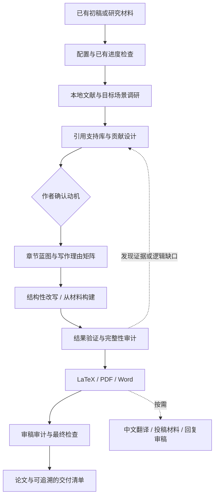

# Super Writer

**从研究材料到有证据支撑的论文：贡献设计、结构化写作、引用核验与交付审计。**

[English](README.en.md) · [安装包](https://github.com/asimfish/super_writer/releases/latest) · [技能入口](SKILL.md) · [使用示例](docs/usage.md) · [设计与验证](docs/validation.md)

[](https://github.com/asimfish/super_writer/actions/workflows/ci.yml)
[](LICENSE)
[](docs/validation.md)

`super_writer` 是一个独立的开源 Agent Skill 仓库，调用名为 **`super-writer`**。
它把作者材料、文献、贡献边界和写作决策组织成可追溯的工作流，支持从已有初稿改写，
也支持从实验材料构建论文。写作由你使用的 AI agent 执行，随包 Python 脚本提供可重复的检查。

本项目从我们的 [Super Skill Team](https://github.com/asimfish/super_skill_team/tree/main/skills/paper/paper-spine)
中的 `paper-spine` 独立维护，基于 [PaperSpine](https://github.com/WUBING2023/PaperSpine) V4。
完整来源、固定提交与 MIT 归属见 [UPSTREAM.md](UPSTREAM.md)。

## 能做什么

| 工作 | 关键设计 | 产物 |
|---|---|---|
| 从材料构建论文 | 先盘点结果、方法、图表和证据缺口 | 素材清单、证据库、claim register、初稿 |
| 对已有论文做结构性改写 | 记录原文逻辑、改写计划与迁移结果 | 原逻辑图、改写矩阵、逻辑迁移审计 |
| 研究定位与贡献设计 | 区分问题动机、实际贡献、证据和声明边界 | 贡献定义、SOTA gap map、作者确认的动机 |
| 学习优秀论文 | 将论证/修辞学习与事实引用分开 | 样例学习档案、目标场景风格 profile |
| 句子级引用支持 | 文献与具体 claim 绑定，核验元数据 | Citation Support Bank、引用质量报告 |
| 先设计再写作 | 每个写作单元说明为什么写、依据什么写 | Writing Rationale Matrix、章节蓝图 |
| 结果与审稿审计 | 结果映射贡献承诺，方法/贡献/表达独立评阅 | 结果验证表、审稿异议与处理记录 |
| 格式与交付 | 检查引用链接、标签、Word 和翻译覆盖 | LaTeX、可编译 PDF、Word、中文翻译 |
| 投稿与返修 | 按请求生成投稿材料或逐条回复 | Highlights、cover letter、审稿回复包 |

支持期刊、会议、报告/综述、竞赛四种场景，中英文输出，以及 `flash` / `pro` 两种调研深度。
风格校准按句长、段落、信息密度、连接词和术语语境进行；不提供“通过 AI 检测”的承诺。

## 如何工作



`SKILL.md` 负责入口和路由，`references/` 按任务加载阶段指南，`agents/` 提供角色卡，
`scripts/` 提供 25 个 Python 工具文件。完整流程会停在需要作者作出实质决定的地方；
单独审计、翻译或回复任务可走对应路径。

## 快速开始

环境：**Python 3.10+**。检查脚本只依赖标准库；正式写作还需要能读取本地文件的 AI agent。
Word 导出需要 Pandoc；PDF 编译需要相应 TeX 工具链。仓库不自带模型、API key、Pandoc 或 TeX。

克隆源码并安装到 Codex 的技能目录：

```bash
git clone https://github.com/asimfish/super_writer.git
cd super_writer
python3 tools/install_skill.py --destination "${CODEX_HOME:-$HOME/.codex}/skills/super-writer"
```

Claude Code 可用 `--destination "$HOME/.claude/skills/super-writer"`。
Windows 使用 `python` 或 `py -3`，目标目录写成自己的完整路径。
安装器只复制技能包，会拒绝覆盖已经存在的目录。安装后在新会话中调用：

```text
使用 $super-writer 改写当前目录的 draft.tex，目标是我指定的会议。
先检查已有进度和材料，确认贡献与动机，再制定逐段写作计划。
保留实验数字和公式，输出英文论文与 Word。
```

也可以从 [Releases](https://github.com/asimfish/super_writer/releases) 下载
`super_writer-v1.0.0-skill.zip`，解压后的 `super-writer/` 即完整技能目录。
支持读取本地 `SKILL.md` 的其他 agent 可以直接使用该目录。
网页端只有在支持解包、读文件和执行 Python 的环境中才可运行检查；否则只能使用文字指南。

更多启动、续写、审计和翻译提示词见 [docs/usage.md](docs/usage.md)。

## 可公开复现的示例

[examples/synthetic-study](examples/synthetic-study/) 包含一组明确标注为合成的材料：
方法说明、CSV 结果、待修改初稿、证据到声明示例及可检查的 LaTeX。
它演示如何从“结果更好”收缩成证据实际支持的陈述，不代表真实实验或发表效果。

[查看示例 PDF](examples/synthetic-study/manuscript.pdf) · [下载示例 Word](examples/synthetic-study/manuscript.docx)


以下开发与验证命令从源码仓库根目录运行：

```bash
python3 scripts/latex_guard.py examples/synthetic-study/manuscript.tex --markdown
python3 scripts/smoke_test.py
python3 -m unittest discover -s tests -v
python3 tools/build_release.py
```

最后一个命令生成带逐文件清单的版本化 ZIP 和 SHA-256 校验文件。
CI 检查的是工具和分发行为；完整学术质量仍需要作者与审稿人的实质判断。

## 交付与兼容

项目输出统一放在 `paper_rewriting_output/`：

```text
paper_rewriting_output/
  paper_spine_config.json
  confirmed_contribution.md
  confirmed_motivation.md
  citation_support_bank.md
  writing_rationale_matrix.md
  results_validation.md
  reviewer_audit.md
  final_paper/
    main.tex
    paper.pdf       # 已成功编译时
    paper.docx      # 英文主文档，未选择关闭 Word 时
    paper.zh.docx   # 中文主文档或请求中文翻译时
```

保留 `paper_spine_config.json`、原产物命名和 `PAPERSPINE_CONFIG_HOME`，便于已有 PaperSpine
项目继续使用。完整运行默认要求 Word，只有显式设置 `word_output=none` 才跳过。

当前继承的部分检查偏向数字引用和紧凑章节结构；特殊模板、作者-年份引用、多文件论文
需要对照真实模板复核。工具通过不等于学术结论正确，也不等于可直接投稿。
具体测试边界与已知限制见 [验证说明](docs/validation.md)。

## 参与与许可

欢迎用可公开分享的最小材料、命令和预期结果提交 issue 或 PR，见 [CONTRIBUTING.md](CONTRIBUTING.md)。
脚本的联网、读写和执行行为见 [skill-card.md](skill-card.md)。

采用 [MIT License](LICENSE)，保留 PaperSpine contributors 的上游版权。
仓库展示形式参考了 [paper-framework-figure-studio-pro](https://github.com/c-narcissus/paper-framework-figure-studio-pro)，
使用示例和说明针对本项目编写，未复制其论文、图片或技能包。
