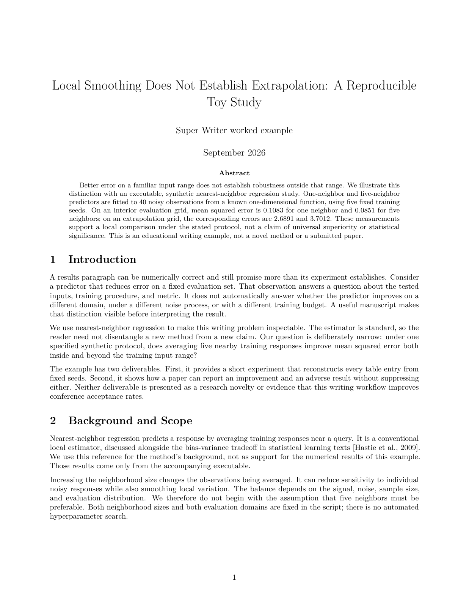
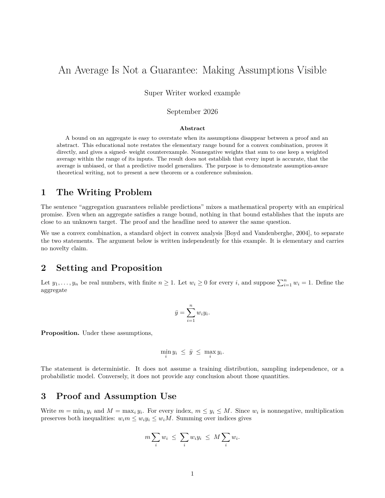
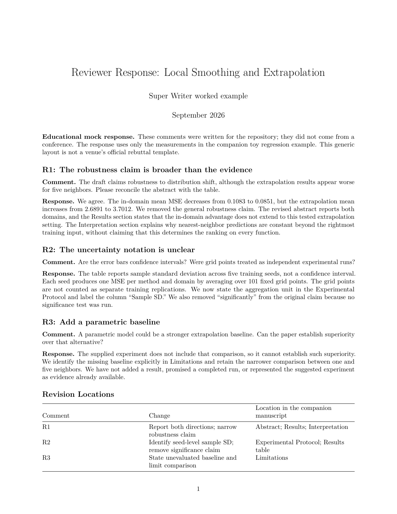
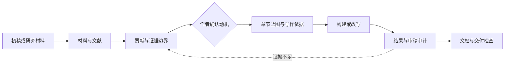

<h1 align="center">Super Writer</h1>
<p align="center"><strong>让论文的每个主张，都有证据和写作理由。</strong></p>
<p align="center">从研究材料到论文初稿、结构性改写与审稿回复的 Agent Skill</p>

<p align="center">中文 · <a href="README.en.md">English</a> · <a href="#examples">看样文</a> · <a href="#quick-start">快速开始</a> · <a href="#verification">验证证据</a> · <a href="SKILL.md">Agent 入口</a></p>

[](https://github.com/asimfish/super_writer/actions/workflows/ci.yml)
[](https://github.com/asimfish/super_writer/releases)
[](LICENSE)
[](docs/validation.md)
[](https://github.com/asimfish/super_writer/stargazers)

**已有实验、方法和初稿，但论文的贡献还不清楚？** Super Writer 先梳理实际贡献与证据边界，
再设计章节和段落，最后检查引用、结果解释与文档交付。它不是一个只换词的润色提示词，
也不会把缺失的实验写成已完成的结果。

仓库名是 `super_writer`，调用名是 **`$super-writer`**。写作由你使用的 AI agent 执行；
Python 脚本负责可重复的检查。项目不自带模型，不承诺录用或 AI 检测通过。

<a id="examples"></a>
## 样文：先看结果

<table>
<tr>
<td width="33%" align="center"><a href="examples/knn-regression/manuscript.pdf"></a></td>
<td width="33%" align="center"><a href="examples/theory-note/manuscript.pdf"></a></td>
<td width="33%" align="center"><a href="examples/review-response/response.pdf"></a></td>
</tr>
<tr>
<td align="center"><strong>可复算实证样文 · 3 页</strong><br><a href="examples/knn-regression/manuscript.md">正文</a> · <a href="examples/knn-regression/manuscript.pdf">PDF</a> · <a href="examples/knn-regression/manuscript.docx">Word</a></td>
<td align="center"><strong>假设与证明短文 · 2 页</strong><br><a href="examples/theory-note/manuscript.md">正文</a> · <a href="examples/theory-note/manuscript.pdf">PDF</a> · <a href="examples/theory-note/manuscript.docx">Word</a></td>
<td align="center"><strong>有依据的审稿回复 · 1 页</strong><br><a href="examples/review-response/response.md">正文</a> · <a href="examples/review-response/response.pdf">PDF</a> · <a href="examples/review-response/response.docx">Word</a></td>
</tr>
</table>

预览直接渲染自仓库中的 PDF，不是效果图。样文是 **AI 辅助编写、据材料核对的教学 worked examples**，
不是真实投稿、录用论文或独立盲测。实证样文的数据生成过程是合成的，但每个表格数字都由公开脚本实际计算；
理论命题是基础知识，审稿意见为构造场景。没有发布私人论文或他人的完整样文。

### 改写不只是换词

| 输入中的过强主张 | 根据材料改写后 |
|---|---|
| “Five-neighbor regression significantly outperforms one-neighbor regression and is robust to distribution shift.” | “On the in-domain grid, five-neighbor regression reduces mean MSE from 0.1083 to 0.0851 across five fixed training seeds. On the extrapolation grid, mean MSE increases from 2.6891 to 3.7012; the in-domain advantage does not extend to this tested setting.” |

改变的是主张范围：保留改善，也保留反向结果；没有做显著性检验，就不写 “significantly”。

[原始材料](examples/knn-regression/materials/) · [实验脚本](examples/knn-regression/experiment.py) ·
[逐段写作依据](examples/knn-regression/writing-decisions.md) · [全部示例与复现](examples/README.md)

<a id="quick-start"></a>
## 快速开始

**需要 Python 3.10+，以及能读取本地 Skill 的 AI agent。** 检查脚本使用 Python 标准库。
Word 导出另需 Pandoc；PDF 编译另需 TeX。只运行检查器，不会自动调用模型写论文。

```bash
git clone https://github.com/asimfish/super_writer.git
cd super_writer
python3 tools/install_skill.py --destination "${CODEX_HOME:-$HOME/.codex}/skills/super-writer"
```

Claude Code 可将目标改为 `"$HOME/.claude/skills/super-writer"`。
Windows 使用 `python` 或 `py -3`，并填写自己的完整目标路径。
安装器拒绝覆盖已有目录；更新时先备份或移走旧安装，保留用户修改。

在新会话中调用：

```text
使用 $super-writer，根据当前目录的 draft.tex、实验表格和方法说明改写会议论文。
先检查材料和已有进度，明确贡献与证据缺口，请我确认研究动机后再设计章节。
保留数字、公式和引用键；目标会议、年份和投稿阶段以我提供的要求为准。
```

只改一个段落也可以：

```text
使用 $super-writer，只审计并改写摘要，不启动整篇论文流程。
列出哪些主张有证据，哪些必须收缩；不要检索文献或补做实验。
```

不使用 Git 时，可从 [Releases](https://github.com/asimfish/super_writer/releases/latest) 下载版本化 Skill ZIP，
解压后的 `super-writer/` 即技能目录。其他 agent 需要支持本地文件读取；执行检查还需要 Python。
[更多提示词与配置](docs/usage.md)

## 适合做什么

| 任务 | 核心动作 | 可检查的产物 |
|---|---|---|
| 从材料构建论文 | 盘点方法、结果、图表与缺口 | 证据库、贡献定义、初稿 |
| 结构性改写 | 分析原逻辑，设计迁移与保留规则 | 改写矩阵、逻辑迁移审计 |
| 贡献与研究定位 | 区分为什么做、做出了什么、证据到哪里 | Contribution、SOTA gap map |
| 学习目标论文写法 | 学论证顺序与证据安排，不复制原句 | 风格 profile、章节蓝图 |
| 引用支持 | 将文献绑定到具体论述，核验元数据 | Citation Support Bank |
| 写作与结果审计 | 逐单元记录依据，让结果回应贡献 | 写作理由矩阵、结果验证表 |
| 投稿准备与返修 | 按范围生成材料、逐条回复与修改定位 | 投稿包、回复包 |
| 格式与翻译交付 | 检查引用、标签、Word 与翻译覆盖 | LaTeX、PDF、Word、中文版本 |

支持期刊、会议、报告/综述、竞赛场景，中英文输出，`flash` / `pro` 调研深度。
它不代替实验执行、作者判断、研究伦理审查或投稿系统，也不会自动发送审稿回复。

## 设计：贡献先于修辞



- **事实与写法分开。** 样文教结构；作者材料和核实过的文献支撑事实。
- **先说明为什么写，再写。** 每个重要写作单元对应证据、目标和主张边界。
- **硬规则与建议分开。** 格式和真实性要求不能被词频、章节数、近期文献比例替代。
- **按需加载。** 局部审计、翻译和回复不用跑完整论文流程。

保留 `paper_rewriting_output/`、`paper_spine_config.json` 等兼容命名。
Word 默认开启，可显式设置 `word_output=none`。章节数量默认仅建议；`max_sections` 才是显式硬预算。
候选文献数量和近期比例默认仅建议，只有 `citation_enforce_heuristics=true` 才强制执行。

<a id="verification"></a>
## 质量：有什么证据

| 验证层 | 实际检查内容 | 不代表什么 |
|---|---|---|
| 跨平台回归 | Linux / macOS / Windows，安装、打包、隐私、文档与检查器 | 所有 agent 都有相同写作表现 |
| 可复算样例 | 20 条实证记录重算、表格舍入、样本标准差、精确分数反例 | 新方法有效或定理已形式化验证 |
| 文档构建 | 真实编译 PDF、检查未解析引用与溢出、导出并检查 Word | 所有视觉问题都可自动检出 |
| 官方模板测试 | 固定版本 ICML 2026 / ICLR 2026 / CVPR 2026 的题名、引用、公式、表格和匿名标记用例 | 整篇论文已满足所有投稿规则 |
| 写作质量 | 公开材料、逐段依据和可阅读样文 | 独立人类盲评、录用率提升或检测器绕过 |

从源码根目录复现：

```bash
python3 scripts/smoke_test.py
python3 -m unittest discover -s tests -v
python3 examples/knn-regression/experiment.py
python3 tools/build_release.py
```

安装 Pandoc、TeX 与 Poppler 后，重新构建样文和运行联网模板检查：

```bash
python3 tools/render_examples.py --output-dir build/rendered-examples
python3 tools/check_template_compatibility.py --output-dir build/template-check
```

模板检查只下载固定公开样式，核对 SHA-256 后在临时目录编译，关闭 shell escape；
不上传论文，不修改官方样式，也不把上游模板重新许可为 MIT。
[完整验证范围](docs/validation.md) · [本版变更与验收](docs/releases/v1.1.0.md)

## FAQ

**和普通润色提示词有什么区别？**

主要是贡献、证据、写作依据、结果解释和文档检查形成的可追溯工作流，不是保证每句话更好看的模型。

**已经完整适配所有顶会了吗？**

没有。当前有三套固定版本的模板编译用例；ACL 引用样式有回归覆盖，但不是完整模板认证。
会议年份、赛道、页数、声明、匿名要求和 rebuttal 规则仍需按官方指南核实。

**检查通过，就能直接投稿吗？**

不能。DOI 匹配不等于引用支持正文主张，脚本通过不等于科学结论正确。
Word 结构检查也不能替代打开文档检查公式、图片和分页。

**数据会发到哪里？**

引用核验可能向 Crossref 发送书目信息，支持的命令可用 `--no-api` 禁用。
写作材料如何进入模型取决于你的 agent 与供应商；本项目不承诺宿主完全离线。
详见 [能力与数据边界](skill-card.md)、[安全说明](SECURITY.md)。

## Roadmap

- [x] 独立安装、可复现分发、跨平台检查。
- [x] 可复算实证、理论短文、审稿回复样例和 PDF / Word 交付。
- [x] 三套官方模板的固定版本编译测试，修复引用与编辑预算误报。
- [ ] 统一的会议、年份、赛道与投稿阶段配置。
- [ ] 更多论文类型的论证蓝图、官方模板和合规检查。
- [ ] 无答案泄漏的 agent 行为评测与独立人类盲评。

## 参与、引用与许可

通过 [Issues](https://github.com/asimfish/super_writer/issues) 报告可复现问题，或按
[贡献指南](CONTRIBUTING.md) 提交修复、模板用例、具备许可的公开材料。
请勿公开私人论文、审稿人身份或密钥。引用本项目可使用 [CITATION.cff](CITATION.cff)。

基于 [PaperSpine](https://github.com/WUBING2023/PaperSpine) V4，从
[Super Skill Team](https://github.com/asimfish/super_skill_team) 独立维护，采用
[MIT License](LICENSE)，保留上游版权。来源和固定提交见 [UPSTREAM.md](UPSTREAM.md)。

展示组织参考 [SuperTranslate](https://github.com/asimfish/super_translate)、
[ARIS](https://github.com/wanshuiyin/auto-claude-code-research-in-sleep) 和
[Figure Studio](https://github.com/c-narcissus/paper-framework-figure-studio-pro)：先看产物，再看机制与验证。
没有复制这些项目的代码、图片、论文或效果数字，也不暗示其背书。
